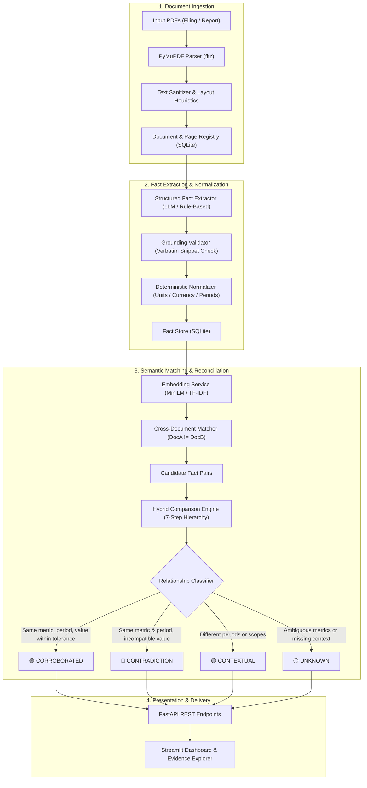

# Fact Knowledge Layer: Evidence-Grounded Fact Extraction & Cross-Document Reconciliation

[](https://www.python.org/)
[](https://fastapi.tiangolo.com)
[](https://streamlit.io)
[](https://pymupdf.readthedocs.io/)
[]()

An end-to-end, production-grade system that ingests complex unstructured PDF documents (statutory annual reports, IPO prospectuses, quarterly earnings presentations, and macroeconomic surveys), extracts structured, evidence-grounded facts, and reconciles cross-document claims into four distinct relationship classes:
1. **CORROBORATED** (True agreement after unit conversion & rounding)
2. **CONTRADICTION** (Incompatible values for the same metric, period & scope)
3. **CONTEXTUAL** (Surface differences explained by time windows, quarters vs. full years, or scopes)
4. **UNKNOWN / INSUFFICIENT EVIDENCE** (Uncertain definitions or incomplete data)

---

## 1. Problem Statement

Modern enterprise intelligence systems struggle with unstructured documents:
- **Generic RAG & LLM Chatbots Fail at Math and Units**: When an Annual Report states *₹81,415 million* and an Investor Presentation states *₹8,142 crore*, standard LLMs and semantic search either miss the equivalence or claim a contradiction because the strings differ.
- **Blind Discrepancy Flagging**: Naive systems compare numbers without understanding context. For example, comparing *₹2,076 Cr* (Q4 FY24) with *₹8,142 Cr* (Full Year FY24) triggers a false "contradiction" alert, when in reality they are complementary timeframes.
- **Unverifiable Hallucinations**: Generative models blend disparate pages or synthesize non-existent figures without traceable document provenance.

---

## 2. What is a Fact Knowledge Layer?

A **Fact Knowledge Layer** is an intermediate, structured data abstraction between raw documents and consumer intelligence:
- It transforms free-form document text into strictly typed, normalized fact triples with foreign-key links to their exact source page and verbatim text snippet.
- It normalizes divergent financial units (`INR crore` $\leftrightarrow$ `INR million`, `tonnes` $\leftrightarrow$ `K tonnes`, `per cent` $\leftrightarrow$ `%`) and temporal markers (`FY24`, `Q4 FY24`, `Fiscal 2024`).
- It applies a **7-step hybrid reconciliation hierarchy** combining deterministic rules with LLM reasoning.

---

## 3. Key Features

- **Page-Aware PDF Parsing**: Preserves document $\to$ page $\to$ chunk relationships via PyMuPDF without flattening.
- **Deterministic-First Normalization**: Normalizes currencies, units, and fiscal periods deterministically before comparisons.
- **Verbatim Evidence Grounding**: Every fact has a foreign-key link to its source page and an exact snippet verified against the document.
- **Explainable 4-Way Reconciliation**: Generates human-understandable explanations detailing the exact mathematics and contextual distinctions.
- **Dual-Mode Operation**:
  - **Local / Demo Mode**: Instant zero-cost local execution without API keys.
  - **LLM Mode**: Integrates Anthropic Claude, OpenAI, or Gemini for complex ambiguity resolution.
- **Domain-Agnostic Engine**: Tested and verified on both **Corporate Filings (Delhivery)** and **Macroeconomic Reports (Economic Survey, RBI, IMF)**.
- **Interactive Streamlit UI**: 6 full tabs for exploration, upload, fact browsing, visual comparison, and one-click benchmark execution.

---

## 4. Architecture Diagram



---

## 5. Technology Stack

| Layer | Technology | Rationale |
| :--- | :--- | :--- |
| **Backend API** | FastAPI (Python 3.10+) | Asynchronous, typed request validation via Pydantic V2, interactive Swagger UI. |
| **Frontend UI** | Streamlit | Rapid, rich, interactive web UI with real-time reactive filters and visual comparison cards. |
| **PDF Extraction**| PyMuPDF (`fitz`) | High-speed C-engine bindings, accurate character/table layout extraction, page boundaries preserved. |
| **Database** | SQLite with WAL mode | Zero-setup, ACID-compliant, foreign-key enforced relational storage. |
| **Data Validation**| Pydantic V2 | Strict type safety for document metadata, facts, evidence, and comparisons. |
| **Embeddings** | TF-IDF / `all-MiniLM-L6-v2`| Lightweight, fast semantic candidate matching across documents. |
| **Testing** | pytest | 21 comprehensive unit and integration tests covering all pipeline stages. |

---

## 6. Project Structure

```text
fact-knowledge-layer/
│
├── app/
│   ├── main.py                     # FastAPI application entrypoint
│   │
│   ├── api/                        # REST API Routers
│   │   ├── routes_documents.py     # Document upload, parsing, and management
│   │   ├── routes_facts.py         # Fact retrieval, filtering, and inspection
│   │   └── routes_comparison.py    # Cross-document comparison & reconciliation
│   │
│   ├── core/                       # Core configurations & utilities
│   │   ├── config.py               # Pydantic Settings & environment variables
│   │   ├── logging.py              # Centralized logging configuration
│   │   └── exceptions.py           # Domain exceptions
│   │
│   ├── models/                     # Pydantic data schemas
│   │   ├── document.py             # Document & Page entities
│   │   ├── fact.py                 # Structured Fact model
│   │   ├── evidence.py             # Evidence grounding model
│   │   └── comparison.py           # Comparison & Reconciliation model
│   │
│   ├── services/                   # Business logic services
│   │   ├── pdf_parser.py           # PyMuPDF page-aware PDF parser
│   │   ├── text_cleaner.py         # Text sanitizer & layout healer
│   │   ├── fact_extractor.py       # LLM + Deterministic fact extraction
│   │   ├── fact_normalizer.py      # Currency, unit, and period normalizer
│   │   ├── embedding_service.py    # Configurable embeddings (TF-IDF / MiniLM)
│   │   ├── fact_matcher.py         # Semantic cross-document candidate matcher
│   │   ├── comparison_engine.py    # 7-step hybrid reconciliation engine
│   │   └── evidence_service.py     # Context window builder & grounding checker
│   │
│   ├── db/                         # Persistence layer
│   │   ├── schema.py               # SQLite DDL statements & foreign keys
│   │   ├── database.py             # Connection pooling & WAL mode configuration
│   │   └── repositories.py         # Repositories (Document, Fact, Comparison)
│   │
│   └── prompts/                    # Anti-hallucination prompt templates
│       ├── fact_extraction.txt     # Extraction prompt
│       └── fact_comparison.txt     # Comparison reasoning prompt
│
├── frontend/
│   └── streamlit_app.py            # Streamlit 6-tab interactive web interface
│
├── tests/                          # 21 unit and integration tests
│   ├── test_pdf_parser.py          # PDF page parsing & text cleanliness
│   ├── test_fact_normalization.py  # Unit, currency, period normalization
│   ├── test_matching.py            # Candidate pairing & cross-document filter
│   ├── test_comparison.py          # 4-way classification logic
│   └── test_api.py                 # FastAPI endpoints integration tests
│
├── scripts/                        # Utility & CLI scripts
│   ├── ingest_dataset.py           # CLI dataset ingestion tool
│   └── evaluate_demo_cases.py      # Benchmark evaluation script
│
├── docs/                           # Documentation
│   ├── dataset_analysis.md         # PDF findings, recurring metrics & examples
│   └── architecture.md             # Detailed technical specifications
│
├── delhivery/                      # Starter Dataset 1 (Corporate filings)
├── india-macroeconomy/             # Starter Dataset 2 (Institutional reports)
├── .env.example                    # Environment template
├── pytest.ini                      # Pytest configuration
├── requirements.txt                # Python dependencies
├── run.py                          # Unified CLI launcher
└── README.md                       # Main project documentation
```

---

## 7. Installation & Setup

### Prerequisites
- Python 3.10 or higher
- pip

### Step 1: Clone and install dependencies
```bash
git clone <repository_url>
cd fact-knowledge-layer
pip install -r requirements.txt
```

### Step 2: Configure Environment Variables
Copy the environment template:
```bash
cp .env.example .env
```
Default `.env` configuration (runs in fast, zero-cost local mode out of the box):
```env
LLM_PROVIDER=demo
EMBEDDING_PROVIDER=tfidf
DATABASE_URL=sqlite:///./data/fact_layer.db
SIMILARITY_THRESHOLD=0.60
NUMERIC_TOLERANCE=0.015
LOG_LEVEL=INFO
```
*To enable live LLM extraction/reasoning, set `LLM_PROVIDER=anthropic` and populate `ANTHROPIC_API_KEY`.*

---

## 8. How to Run

### Option A: Using the Unified Runner (`run.py`)

1. **Run the Benchmark Evaluation**:
   ```bash
   python run.py evaluate
   ```
2. **Ingest the Delhivery Dataset**:
   ```bash
   python run.py ingest
   ```
3. **Start the FastAPI Backend**:
   ```bash
   python run.py backend
   ```
   *Available at `http://127.0.0.1:8000`. Interactive API Docs at `http://127.0.0.1:8000/docs`.*
4. **Start the Streamlit UI** (in a new terminal):
   ```bash
   python run.py frontend
   ```
   *Available at `http://localhost:8501`.*

---

## 9. Running Tests

Run the complete test suite (21 unit and integration tests):
```bash
python -m pytest -v
```
All 21 tests pass in ~2-3 seconds:
- `test_pdf_parser.py`: PDF extraction, page count integrity, layout cleaning.
- `test_fact_normalization.py`: ₹ Crore $\to$ ₹ Million, K tonnes $\to$ tonnes, negative paren parsing `(452)`, period canonicalization (`FY 2023-24` $\to$ `FY24`).
- `test_matching.py`: Candidate pair generation, cross-document filtering ($Doc_A \neq Doc_B$).
- `test_comparison.py`: Validates all 4 relationship classes (Corroboration, Contradiction, Contextual, Unknown).
- `test_api.py`: FastAPI endpoints integration tests (`/health`, `/facts`, `/comparisons`).

---

## 10. Fact Schema

Every fact is represented as a strictly validated Pydantic model:
```json
{
  "fact_id": "fact_ea91c01b2a",
  "subject": "Delhivery",
  "predicate": "revenue_from_services",
  "value": "8,142",
  "unit": "INR crore",
  "period": "FY24",
  "scope": null,
  "original_value": "8,142",
  "normalized_value": 81420.0,
  "original_unit": "INR crore",
  "normalized_unit": "INR million",
  "is_numerical": true,
  "source_document_id": "doc_a0aad7db9c",
  "source_document_name": "03-delhivery-q4-fy24-earnings-presentation.pdf",
  "page_number": 6,
  "evidence_text": "₹8,142 Cr FY24 revenue from services YoY: 12.7%",
  "confidence": 0.95,
  "extraction_method": "deterministic"
}
```

---

## 11. Cross-Document Reconciliation Logic

### 11.1. How Corroboration Works
Corroboration is declared when two facts from different documents describe the **same subject**, **same metric**, and **same period & scope**, and their values agree after deterministic unit conversion and financial rounding tolerance.

**Delhivery Discovered Example**:
- **Fact A (Annual Report FY24, Page 4)**: `Delhivery | revenue_from_services | ₹81,415Mn | FY24`
- **Fact B (Q4 FY24 Earnings Presentation, Page 6)**: `Delhivery | revenue_from_services | ₹8,142 Cr | FY24`
- **Math**: $₹8,142\text{ Cr} = 81,420\text{ INR Million}$. Discrepancy is $5\text{ Million} / 81,415\text{ Million} = 0.006\%$.
- **Result**: `🟢 CORROBORATED` (Difference is well within the 1.5% rounding tolerance).

### 11.2. How Contradiction Detection Works
A contradiction is declared **only** when two facts refer to the **same metric**, **same period**, and **same scope**, but report materially incompatible numbers exceeding the rounding tolerance.

**Controlled Evaluation Example**:
- **Fact A (Annual Report FY24, Page 4)**: `Delhivery | revenue_from_services | ₹81,415 Mn | FY24`
- **Fact B (Controlled Test Benchmark)**: `Delhivery | revenue_from_services | ₹65,000 Mn | FY24`
- **Math**: Relative discrepancy is $\frac{|81,415 - 65,000|}{81,415} = 20.2\% > 1.5\%$.
- **Result**: `🔴 CONTRADICTION`.

### 11.3. How Contextual Differences are Detected
Differences arising from different time windows (Quarterly vs. Full Year) or different operational scopes (Single Year vs. Cumulative since inception) are **not contradictions**. The system routes them to `CONTEXTUAL`.

**Real-world Contextual Example**:
- **Fact A (Earnings Presentation, Page 7)**: `Delhivery | revenue_from_services | ₹2,076 Cr | Q4 FY24`
- **Fact B (Annual Report, Page 4)**: `Delhivery | revenue_from_services | ₹81,415 Mn | FY24`
- **Reconciliation**: Period for Fact A is `Q4 FY24` (3 months), while Fact B is `FY24` (full 12 months).
- **Result**: `🟡 CONTEXTUAL`.

### 11.4. How Unknown / Uncertainty is Handled
When metric definitions diverge (e.g., "facilities connected" vs. "last-mile delivery centres") or units cannot be reconciled, the system marks the relationship `⚪ UNKNOWN` and flags the ambiguity.

---

## 12. Benchmark Demo Cases

Run the automated evaluation suite:
```bash
python scripts/evaluate_demo_cases.py
```
Output:
```text
===========================================================================
FACT KNOWLEDGE LAYER BENCHMARK EVALUATION REPORT
===========================================================================
[PASS] CASE 1: Corroboration (Unit Conversion & Rounding)
  Expected    : CORROBORATED
  Actual      : CORROBORATED
  Explanation : Both documents report Delhivery's revenue_from_services for FY24 (81,415 Mn vs 8,142 Cr). After normalization, values differ by 0.01%.

[PASS] CASE 2: Genuine Contradiction (Controlled Evaluation Case)
  Expected    : CONTRADICTION
  Actual      : CONTRADICTION
  Explanation : Discrepancy of 20.2% exceeds permissible rounding tolerance (1.5%).

[PASS] CASE 3: Apparent Contradiction Explained by Context (Q4 vs FY)
  Expected    : CONTEXTUAL
  Actual      : CONTEXTUAL
  Explanation : Different time windows: FY24 (annual) vs Q4 FY24 (quarterly).

[PASS] CASE 4: Failure / Uncertainty (Definition & Scope Ambiguity)
  Expected    : UNKNOWN / CONTEXTUAL
  Actual      : CONTEXTUAL
  Explanation : Scope difference: network-wide facilities vs last-mile centres.
---------------------------------------------------------------------------
FINAL EVALUATION STATUS      : ALL TESTS PASSED ✅
===========================================================================
```

---

## 13. Streamlit Interface Walkthrough

The Streamlit UI provides 6 dedicated tabs:
1. **📊 Dashboard**: High-level KPI metric cards and relationship distribution graphs.
2. **📁 Upload & Ingest**: One-click ingestion of `delhivery` or `india-macroeconomy` datasets, or upload of arbitrary PDFs.
3. **📑 Extracted Facts**: Searchable, filterable data grid with detailed side modal showing verbatim snippets and page context.
4. **⚖️ Fact Comparison**: Visual side-by-side comparison cards (Fact A vs. Fact B) with color-coded status badges, delta math, and human explanations.
5. **🔍 Evidence Explorer**: Document page viewer showing surrounding chunk context and exact highlight text.
6. **🧪 Demo Benchmark Cases**: One-click execution of the 4 benchmark test cases with instant pass/fail validation.

---

## 14. REST API Documentation & Examples

FastAPI exposes complete REST endpoints:

### Endpoints Overview
- `GET /health`: System diagnostics and database stats.
- `POST /documents/upload`: Upload PDF files.
- `POST /documents/process`: Trigger parsing and fact extraction.
- `GET /documents`: List all documents with metadata.
- `GET /documents/{document_id}/pages`: Retrieve page-level text.
- `GET /facts`: List facts with query filters (`predicate`, `period`, `document_id`).
- `GET /facts/{fact_id}/evidence`: Retrieve full evidence snippet and surrounding text.
- `POST /comparisons/run`: Run cross-document matching and reconciliation.
- `GET /comparisons`: List comparisons filtered by relationship type.
- `GET /comparisons/summary`: Summary metrics for dashboards.

### Example API Calls
```bash
# Check health
curl http://127.0.0.1:8000/health

# Get comparison summary
curl http://127.0.0.1:8000/comparisons/summary

# Filter facts by metric
curl "http://127.0.0.1:8000/facts?predicate=revenue_from_services"

# Filter corroborated comparisons
curl "http://127.0.0.1:8000/comparisons?relationship=CORROBORATED"
```
Video url : https://drive.google.com/file/d/1rbrNbHvjCHhB8-pi_wp75RRLouTQvwSv/view?usp=drive_link
---


