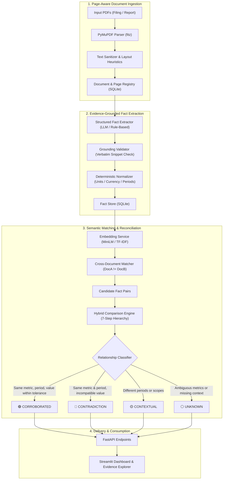
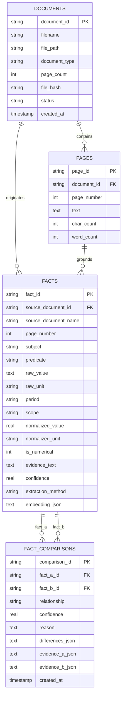

# Fact Knowledge Layer: System Architecture & Technical Specifications

**Author**: Senior AI Engineer & Systems Architect  
**Purpose**: Comprehensive technical specification for the Fact Knowledge Layer system — an evidence-grounded document ingestion, fact extraction, and cross-document reconciliation pipeline.

---

## 1. System Overview & Problem Statement

Large Language Model (LLM) implementations in document analysis frequently suffer from two fatal failure modes:
1. **Unverifiable Hallucination**: Generative summaries often invent figures, misattribute citations, or blend disparate reporting periods.
2. **Naive Contradiction Detection**: Standard retrieval-augmented chatbots (RAG) treat any differing numbers as a "contradiction," failing to recognize that quarterly vs. annual reporting (e.g., Q4 FY24 vs. Full Year FY24), differing units (INR Crore vs. INR Million), or differing operational scopes (cumulative since inception vs. annual volume) are valid contextual distinctions, not errors.

The **Fact Knowledge Layer** solves this by establishing a deterministic, evidence-grounded layer between raw documents and end-user intelligence. Every extracted claim is represented as a structured data point with foreign-key links to its source page and verbatim text, and cross-document comparisons are evaluated using a 7-step hierarchical reconciliation pipeline.

---

## 2. Pipeline Components

### 2.1. Page-Aware PDF Parsing (`app/services/pdf_parser.py`)
- **Library**: `pymupdf` (MuPDF C-library bindings for Python).
- **Design Decision**: Rather than flattening the entire document into an ungrounded string, extraction operates strictly page-by-page.
- **Metadata Preserved**: Document SHA256 checksum, page index (1-indexed), character count, word count, document classification heuristics (`prospectus`, `annual_report`, `earnings_presentation`).

### 2.2. Text Cleaning & Formatting Preservation (`app/services/text_cleaner.py`)
Financial documents present unique normalization challenges:
- **Currency Symbols**: `₹`, `Rs.`, `Rs`, `$`, `USD`, `INR` are preserved intact.
- **Negative Financial Brackets**: Values formatted as `(452)` or `(4,516)` are parsed as negative quantities rather than isolated parenthesized numbers.
- **Broken Hyphenation**: De-hyphenates split words across line-breaks while preserving metric-unit boundaries (`₹8,142 Cr`).
- **Context Windows**: Extracts 200-character surrounding context windows around key evidence snippets for human verification.

### 2.3. Fact Normalization Engine (`app/services/fact_normalizer.py`)
Operates **deterministically without LLM hallucinations**:
1. **Currency Scaling**:
   $$1\text{ Crore} = 10\text{ Million}$$
   - `₹8,142 crore` $\to$ `81,420.0 INR million`
   - `₹81,415 million` $\to$ `81,415.0 INR million`
2. **Mass & Tonnage**:
   $$1\text{ K tonnes} = 1,000\text{ tonnes},\quad 1\text{ Mn tons} = 1,000,000\text{ tonnes}$$
   - `1,429K tonnes` $\to$ `1,429,000.0 tonnes`
   - `1.4 Mn Tons` $\to$ `1,400,000.0 tonnes`
3. **Temporal Normalization**:
   - Matches regex patterns to canonical period keys: `FY 2023-24`, `FY 2024`, `Fiscal 2024`, `FY24` $\to$ `FY24`.
   - Distinguishes quarterly reporting: `Q4 FY24`, `Q3 FY24`.
   - Distinguishes cumulative metrics: `Inception to Date`.

### 2.4. Semantic Embeddings & Candidate Matching (`app/services/fact_matcher.py`)
- **Representation**: Facts are serialized into canonical semantic strings:
  `Subject | Predicate | Normalized Period | Normalized Unit | Normalized Value`
- **Embedding Provider**: Configurable via `EMBEDDING_PROVIDER`. Supports `sentence-transformers` (`all-MiniLM-L6-v2`) or scikit-learn TF-IDF fallback.
- **Candidate Filtering**:
  - Requires $Doc_A \neq Doc_B$ (eliminates self-comparisons).
  - Matches exact predicates or cosine similarity $\ge 0.60$.
  - Deduplicates $(A, B)$ and $(B, A)$ symmetric pairs.

---

## 3. The 7-Step Hybrid Comparison Engine (`app/services/comparison_engine.py`)

Rather than delegating classification entirely to an unpredictable LLM prompt, the comparison engine executes a strict deterministic-first hierarchy:

| Step | Check | Outcome / Routing |
| :--- | :--- | :--- |
| **Step 1** | **Deterministic Alignment** | Verifies subject and metric compatibility. Unrelated claims route to `UNKNOWN`. |
| **Step 2** | **Unit Normalization** | Converts raw quantities to common base (`INR million`, `tonnes`, `million`). Incompatible units route to `UNKNOWN`. |
| **Step 3** | **Period Compatibility** | If one fact refers to `Q4 FY24` and the other to `FY24`, or `FY23` vs `FY24`, routes immediately to `CONTEXTUAL`. |
| **Step 4** | **Scope Compatibility** | If one fact is `since inception` and the other is `single fiscal year`, routes immediately to `CONTEXTUAL`. |
| **Step 5** | **Numeric Tolerance Check** | For facts sharing metric, period, and scope: calculates relative discrepancy $\delta = \frac{\|v_a - v_b\|}{\max(\|v_a\|, \|v_b\|)}$. If $\delta \le 1.5\%$ (rounding tolerance) $\to$ `CORROBORATED`. If $\delta > 1.5\%$ $\to$ `CONTRADICTION`. |
| **Step 6** | **Semantic Equality** | For qualitative claims, verifies exact or synonym equivalence. |
| **Step 7** | **LLM Ambiguity Reasoning** | If definitions or scopes remain ambiguous, passes structured prompt to LLM to produce an explainable verdict or marks `UNKNOWN`. |

---

## 4. Database Schema Design (SQLite)

---

## 5. Technology Stack Rationale

1. **FastAPI**:
   - Asynchronous request handling with automatic OpenAPI documentation (`/docs`).
   - Strict request/response typing via Pydantic V2 ensuring structured data validation.
2. **Streamlit**:
   - Rapid, interactive data dashboard without frontend microservice overhead.
   - Live reactive filtering, tabular drill-downs, and visual side-by-side reconciliation cards.
3. **SQLite**:
   - Zero configuration, zero external service dependency.
   - ACID compliant with WAL mode (`PRAGMA journal_mode=WAL`) and foreign key enforcement (`PRAGMA foreign_keys=ON`).
4. **PyMuPDF (`fitz`)**:
   - Fastest open-source C-based PDF text extractor with high character coordinate precision and font metric preservation.
5. **Sentence-Transformers (`all-MiniLM-L6-v2`)**:
   - Lightweight (80MB model), local execution, cosine similarity for fast vector clustering.
